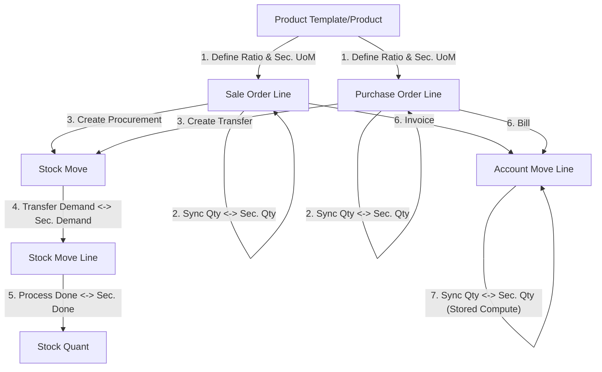

# Product Secondary UoM

This module extends Odoo 19 to support secondary Units of Measure (UoM) across Sales, Purchase, Inventory, and Invoicing. It allows users to track quantities in an alternative unit while maintaining the primary inventory in the standard Odoo UoM.

## Features

- **Secondary UoM Configuration**: Enable and configure secondary units per product.
- **Automatic Conversion**: Real-time conversion between primary and secondary quantities based on a defined ratio.
- **Cross-Module Support**:
  - **Sales**: Enter quantities in boxes/palettes while Odoo tracks units.
  - **Purchase**: Buy in alternative units and automatically calculate stock intake.
  - **Inventory**: Track stock levels and movement in both primary and secondary units.
  - **Invoicing**: Inherit secondary quantities on invoices for better customer communication.
- **Clean UI**: Secondary fields are hidden by default in list views to maintain a clean interface, but can be easily enabled via the view selector.

## Installation

1. Copy the `product_secondary_uom` folder to your Odoo custom addons directory.
2. Restart your Odoo server.
3. Enable developer mode.
4. Go to **Apps** -> **Update Apps List**.
5. Search for `product_secondary_uom` and click **Activate**.

## Configuration

1. Open a **Product** form (Storable products only).
2. Check the **Enable Secondary UoM** checkbox (located under the Quantity on Hand section).
3. A new tab **Secondary UoM** will appear.
4. Select the **Secondary UoM** and define the **Ratio**.
   - *Example*: If 1 Box = 10 Units, select 'Box' and set Ratio to 0.1 (since 1 Unit * 0.1 = 0.1 Box).
5. Choose the **Secondary Tracking Type** (None, Stored, or Computed).

## Usage

- In **Sales Orders**, **Purchase Orders**, or **Inventory Transfers**, you can show the `Secondary Qty` and `Secondary UoM` fields in the item lines using the "three dots" menu on the right of the list view header.
- Editing either the primary or secondary quantity will automatically update the other based on the product's ratio.

## Logic Flow

The following chart illustrates how secondary units of measure are handled across different Odoo modules:

## Technical Details

- **Module Name**: `product_secondary_uom`
- **Odoo Version**: 19.0
- **Dependencies**: `sale_management`, `purchase`, `stock`, `account`, `uom`
